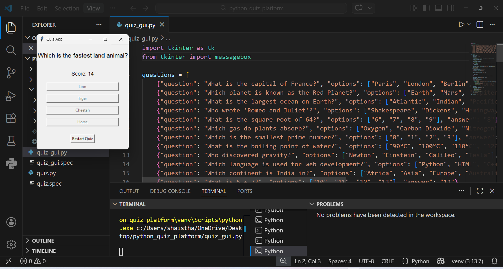

# Python Quiz App

GUI-based quiz application using tkinter with live score tracking and restart functionality.

## Features
- Multiple choice questions
- Live score display
- Restart quiz option
- User-friendly interface

## Technologies
- Python
- Tkinter

## Screenshots

## How to Run
1. Install Python
2. Download the file
3. Open terminal / command prompt
4. Run:
   python quiz_gui.py

## Author
Shaistha R
